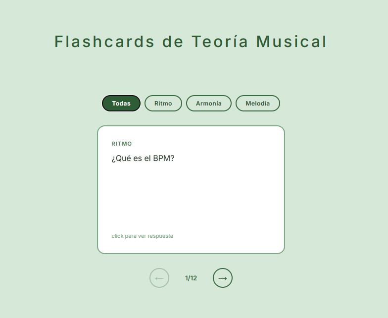

# 🎼 Music Theory Flashcards

An interactive flashcard app for learning music theory concepts, built as a portfolio project by a classical musician transitioning to frontend development.

**[Live Demo](https://music-theory-flashcards.netlify.app)**



---

## Features

- Flip animation with CSS 3D transforms (no libraries)
- Filter cards by category: Rhythm, Harmony, Melody
- Self-assessed scoring — "Got it" / "Didn't get it"
- Automatic progression after each answer
- Results summary with score breakdown and restart
- Responsive layout with subtle paper-texture background

---

## Tech Stack

| Technology    | Purpose                                |
| ------------- | -------------------------------------- |
| React 18      | UI framework                           |
| TypeScript    | Type safety across components and data |
| Vite 6        | Build tool and dev server              |
| CSS (vanilla) | Styling and 3D flip animation          |

---

## Architecture

The project follows a clear separation between logic and UI:

**Custom hook — `useDeck`**
All deck logic lives in a custom hook: state management, filtering, navigation, scoring, and derived values (`isFirst`, `isLast`, `filterCards`). The `Deck` component receives everything it needs via destructuring and contains only JSX.

**Component tree**

```
App
└── Deck
    ├── CategoryFilter
    ├── FlashCard
    ├── NavControls
    └── Summary
```

**Data layer**
Cards are defined as a typed array of `Flashcard` objects in `src/data/flashcards.ts`, fully decoupled from the UI. Adding new cards requires no component changes.

**TypeScript**
Union types are used for constrained fields (`difficulty`, `category`) to prevent invalid data at compile time rather than runtime.

---

## Getting Started

```bash
# Clone the repo
git clone https://github.com/tu-usuario/music-theory-flashcards.git
cd music-theory-flashcards

# Install dependencies
npm install

# Start dev server
npm run dev

# Build for production
npm run build
```

---

## About

Built by Pedro — classical orchestra conductor learning frontend development. Music-themed projects allow domain expertise to inform technical decisions, such as structuring time signature data for the companion [Web Metronome](https://github.com/tu-usuario/metronome-lite) project.
